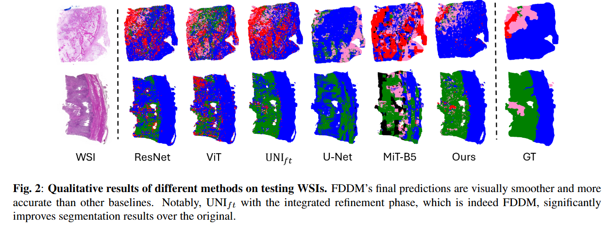

# Bridging Classification and Segmentation in Osteosarcoma Assessment via Foundation and Discrete Diffusion Models

This the reporatory containing source code for ISBI 2025 submission titled "Bridging Classification and Segmentation in Osteosarcoma Assessment via Foundation and Discrete Diffusion Models".

* Data processing stage can be found in [here](./RAW/process/)
* BBDM training stage can be found in [here](./BBDM2/)
* Our proposed FDDM can be found in [here](./src/)

### Results
